# Week 5 – MySQL

## Database Structure
- Database: `website`
- Tables:
  - `member`
  - `message`

## Task 2 – 建立資料庫與資料表

### 2.1 建立資料庫
```sql
CREATE DATABASE website;
USE website;
```

### 2.2 建立 member 資料表
CREATE TABLE member(
  id INT PRIMARY KEY AUTO_INCREMENT,
  name VARCHAR(255) NOT NULL,
  email VARCHAR(255) NOT NULL,
  password VARCHAR(255) NOT NULL,
  follower_count INT UNSIGNED NOT NULL DEFAULT 0,
  `time` DATETIME NOT NULL DEFAULT CURRENT_TIMESTAMP
);

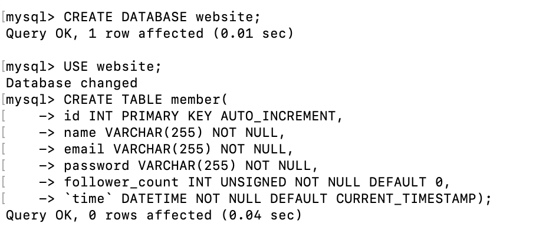

## Task 3 – 新增、查詢、更新資料
### 3.1 新增資料
INSERT INTO member(name,email,password) VALUES('test','test@test.com','test');
INSERT INTO member(name,email,password) VALUES('eric','eric@gmail.com','1234');
INSERT INTO member(name,email,password) VALUES('ann','ann@gmail.com','5678');
INSERT INTO member(name,email,password) VALUES('joy','joy@gmail.com','abcd');
INSERT INTO member(name,email,password) VALUES('alex','alex@gmail.com','0000');

UPDATE member SET follower_count = 3974 WHERE email = 'alex@gmail.com';
UPDATE member SET follower_count = 4758 WHERE email = 'joy@gmail.com';
UPDATE member SET follower_count = 1379 WHERE email = 'ann@gmail.com';
UPDATE member SET follower_count = 5803 WHERE email = 'eric@gmail.com';
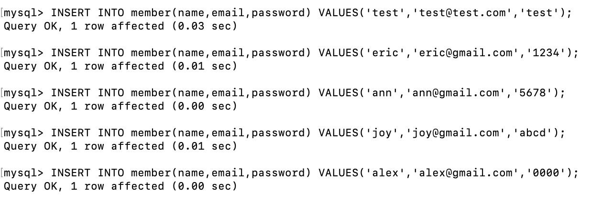


### 3.2 查詢所有資料
SELECT * FROM member;
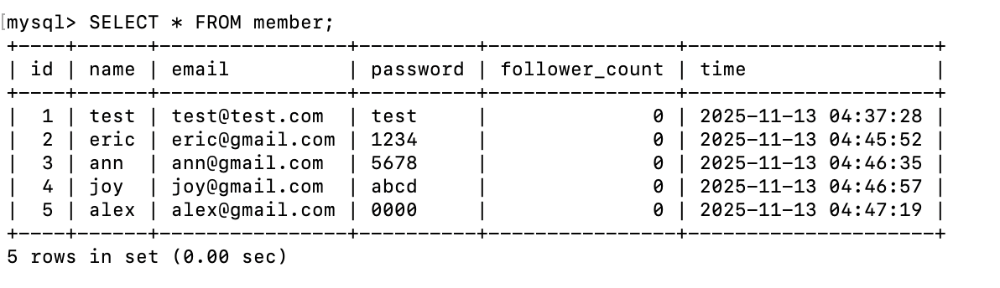

### 3.3 依時間排序（DESC）
SELECT * FROM member ORDER BY `time` DESC;
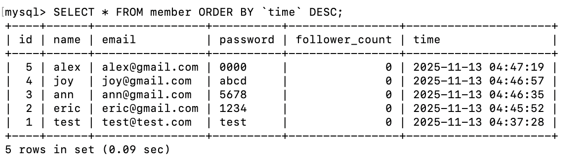

### 3.4 取第 2–4 筆資料
SELECT * FROM member
ORDER BY `time` DESC
LIMIT 3 OFFSET 1;
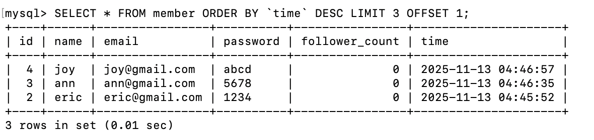

### 3.5 查詢 email = 'test@test.com'
SELECT * FROM member
WHERE email = 'test@test.com';
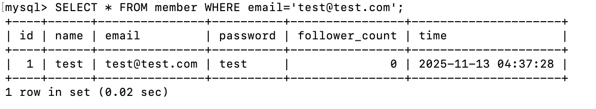

### 3.6 查詢 name 包含 'es'
SELECT * FROM member
WHERE name LIKE '%es%';
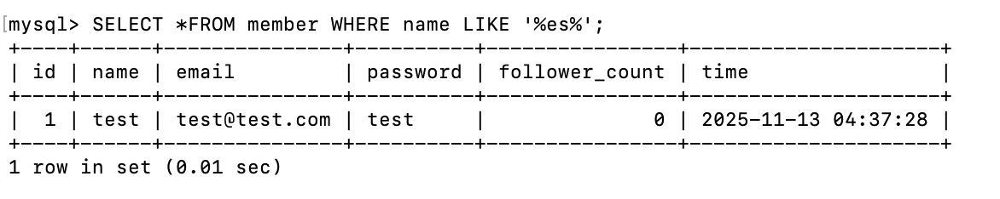

### 3.7 查詢 email 為 test@test.com 且 password 為 test 的會員
SELECT * FROM member
WHERE email = 'test@test.com' AND password = 'test';
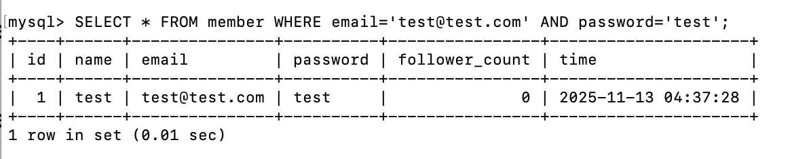

### 3.8 更新 email 為 test@test.com 的會員姓名為 test2
UPDATE member
SET name = 'test2'
WHERE email = 'test@test.com';
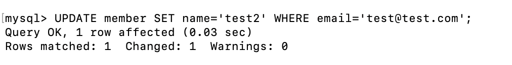

## Task 4 – 聚合函式
### 4.1 計算會員總數
SELECT COUNT(*) FROM member;
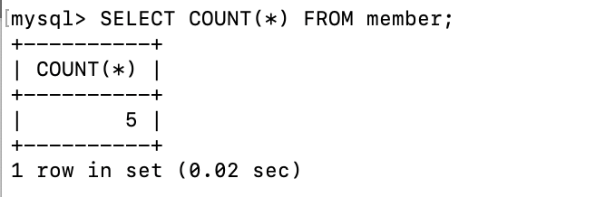

### 4.2 計算所有會員 follower_count 總和
SELECT SUM(follower_count) FROM member;
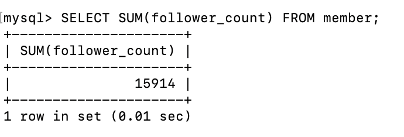

### 4.3 計算所有會員 follower_count 平均數
SELECT AVG(follower_count) FROM member;
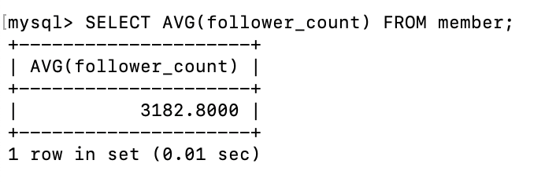

### 4.4 計算 follower_count 最高的兩位會員的平均 follower_count
SELECT AVG(follower_count)
FROM (
  SELECT follower_count
  FROM member
  ORDER BY follower_count DESC
  LIMIT 2
) AS top_two;
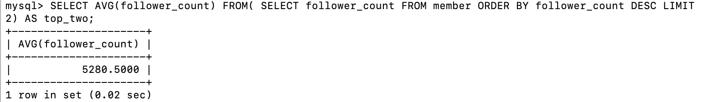

## Task 5 – 建立 message 表格與 JOIN 查詢
### 5.1 建立 message 資料表、新增資料
CREATE TABLE message(
  id INT UNSIGNED PRIMARY KEY AUTO_INCREMENT,
  member_id INT NOT NULL,
  content TEXT NOT NULL,
  like_count INT UNSIGNED NOT NULL DEFAULT 0,
  `time` DATETIME NOT NULL DEFAULT CURRENT_TIMESTAMP,
  FOREIGN KEY (member_id) REFERENCES member(id)
);
INSERT INTO message (member_id, content, like_count) VALUES (1, 'HI HI',    13);
INSERT INTO message (member_id, content, like_count) VALUES (1, 'cool',     25);
INSERT INTO message (member_id, content, like_count) VALUES (1, 'nice pic!',10);
INSERT INTO message (member_id, content, like_count) VALUES (2, 'wow',      39);
INSERT INTO message (member_id, content, like_count) VALUES (3, 'Hello',     4);
INSERT INTO message (member_id, content, like_count) VALUES (2, 'Great!',   21);
.png)
.png)

### 5.2 JOIN 查全部訊息
SELECT
  message.id,
  member.name,
  message.content,
  message.like_count,
  message.`time`
FROM message
INNER JOIN member
  ON message.member_id = member.id;


### 5.3 查 email = 'test@test.com' 的所有訊息
SELECT
  message.id,
  member.name,
  member.email,
  message.content,
  message.like_count,
  message.`time`
FROM message
INNER JOIN member
  ON message.member_id = member.id
WHERE member.email = 'test@test.com'
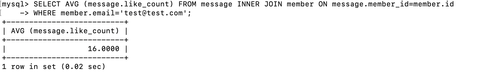

### 5.4 查 email = 'test@test.com' 平均 like_count
SELECT
  AVG(message.like_count)
FROM message
INNER JOIN member
  ON message.member_id = member.id
WHERE member.email = 'test@test.com';


### 5.5 依 email 分組的平均 like_count
SELECT
  member.email,
  AVG(message.like_count)
FROM message
INNER JOIN member
  ON message.member_id = member.id
GROUP BY member.email;
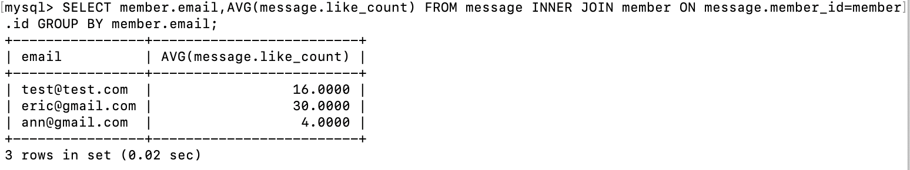

## 匯出資料 data.sql
